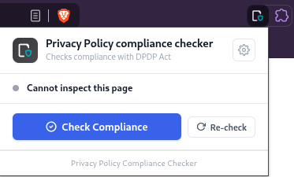
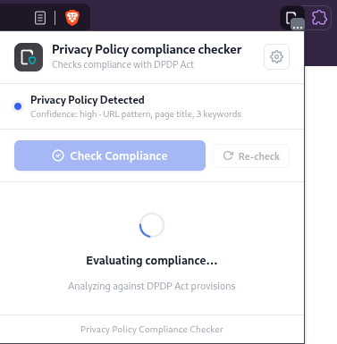
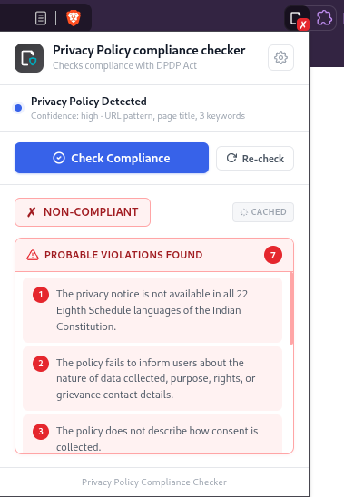

# DPDP Compliance Checker — Browser Extension

Extension that evaluates DPDP Act compliance.

---

## Directory Structure

```
extension/
├── manifest.json        # MV3 manifest
├── content.js           # Privacy policy detection + page extraction
├── background.js        # Service worker: API calls, caching, badge
├── popup.html           # Extension popup layout
├── popup.js             # Popup JavaScript logic
├── styles.css           # Popup styling
└── icons/
    ├── icon16.png
    ├── icon48.png
    └── icon128.png
```

---

## How to Load in Browser

1. Download the zip file and extract it
2. Open `chrome://extensions` (or `edge://extensions` or extensions management page in your browser)
3. Enable **Developer Mode** (top-right toggle)
4. Click **Load unpacked**
5. Select the extracted `privacy-policy-compliance-extension/` folder
6. The extension icon appears in your toolbar
---

## Features

| Feature | Detail |
|---|---|
| **Auto-detection** | Scans URL, page title, and body text for privacy policy keywords |
| **Manual check** | "Check Compliance" button works on any page |
| **Result badge** | Green `✓` (compliant) or Red `✗` (non-compliant) |
| **Configurable backend** | Set your backend URL via the ⚙️ settings panel |

---

## Work Flow

### Privacy Policy Detection

*Extension detects a privacy policy and displays confidence level with page analysis details*

### Evaluation in Progress

*Real-time compliance evaluation against DPDP Act provisions*

### Compliance Results with Violations

*Detailed violation report showing specific DPDP Act compliance issues found in the privacy policy*

---

## Backend Integration

The extension sends a `POST` request to the backend:

### Request
```json
POST "https://ajaydhaker.pythonanywhere.com/"
Content-Type: application/json

{
  "url": "https://example.com/privacy",
  "title": "Privacy Policy | Example",
  "content": "<full page text>"
}
```

### Expected Response
```json
{
  "status": "COMPLIANT" | "NON_COMPLIANT",
  "violations": ["Missing opt-out mechanism", "No lawful purpose specified"]
}
```

> **Backend Not Running?** The extension gracefully shows a "Backend Unreachable" error, whenever the backend is not running. We have hosted backend at `https://ajaydhaker.pythonanywhere.com/`.
If you face any issues can contact us at ajaydhaker2002@gmail.com
---

## Keyword Detection Logic

The content script scores pages using:
- **URL pattern match** → High confidence (`/privacy`, `/cookie`, `/data-policy`)
- **Page title match** → Medium confidence
- **Body text** → 3+ keyword hits from a list of 23 DPDP relevant terms

All three signals are combined; any match triggers the "Privacy Policy Detected" banner.
